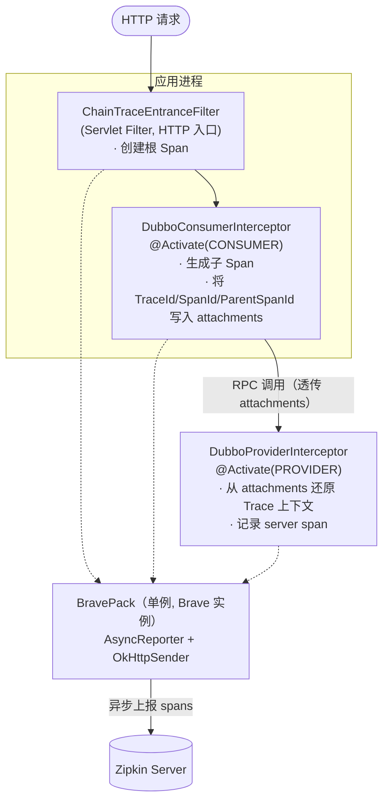

# giants-dubbo 框架使用手册

## 目录

1. [框架概述](#1-框架概述)
2. [整体架构](#2-整体架构)
3. [核心组件](#3-核心组件)
4. [配置说明](#4-配置说明)
5. [集成指南](#5-集成指南)
6. [链路追踪原理](#6-链路追踪原理)
7. [异常处理机制](#7-异常处理机制)
8. [常见问题](#8-常见问题)

---

## 1. 框架概述

giants-dubbo 是构建在 Apache Dubbo（`com.alibaba:dubbo:2.6.12`）之上的功能扩展组件，核心目标是为分布式的 Dubbo 服务集群提供 **分布式链路追踪** 能力。

在微服务架构下，一次外部请求往往会跨越多个服务节点。当出现性能瓶颈或调用异常时，仅凭单机日志难以还原完整的调用路径。giants-dubbo 借助 Zipkin + Brave，将每一次跨进程调用串联成一条完整的链路（Trace），并以可视化的方式呈现在 Zipkin UI 中。

组件的设计原则是 **零侵入**：业务方无需修改任何 Java 代码，仅通过 Dubbo 的 SPI 扩展机制与少量配置即可完成接入。

---

## 2. 整体架构



所有过滤器与拦截器共享同一个 `BravePack` 单例，由它统一持有 `Brave` 实例并负责将采集到的 span 异步上报至 Zipkin。

---

## 3. 核心组件

### 3.1 BravePack

`com.giants.dubbo.chain.trace.zipkin.BravePack`

Brave 的单例包装对象，采用双重检查锁（DCL）保证全局唯一。构造时完成以下工作：

- 从 Dubbo 配置读取应用名（`dubbo.application.name`）作为 Zipkin 中展示的服务名；
- 从配置读取 Zipkin 收集端地址（`dubbo.chain.trace.zipkin.address`）；
- 构建 `AsyncReporter`（基于 `OkHttpSender`）用于异步上报 span；
- 构建并持有 `Brave` 实例，供各拦截器获取 request/response interceptor。

```java
Brave brave = BravePack.getInstance().getBrave();
```

### 3.2 DubboProviderInterceptor

`com.giants.dubbo.chain.trace.zipkin.DubboProviderInterceptor`

Dubbo 服务 **提供者** 过滤器，通过 `@Activate(group = Constants.PROVIDER)` 标记，仅在 Provider 端生效。

职责：

- 请求进入时，从 Dubbo `Invocation` 的 attachments 中读取 `TraceId`、`SpanId`、`ParentSpanId`、`Sampled`，还原出上游传递的 Trace 上下文（`ServerRequestInterceptor`）；
- 以「接口全限定名 + 方法名」作为 span 名称；
- 调用结束后记录响应结果（`ServerResponseInterceptor`），并对异常进行语义标记。

### 3.3 DubboConsumerInterceptor

`com.giants.dubbo.chain.trace.zipkin.DubboConsumerInterceptor`

Dubbo 服务 **消费者** 过滤器，通过 `@Activate(group = Constants.CONSUMER)` 标记，仅在 Consumer 端生效。

职责：

- 发起调用前，生成客户端 Span，并将 `Sampled`、`TraceId`、`SpanId`、`ParentSpanId` 写入 attachments，随 RPC 透传到下游 Provider（`ClientRequestInterceptor`）；
- 以「接口全限定名 + 方法名」作为 span 名称；
- 以 JSON 形式记录调用参数（`params` 注解），便于问题追溯；
- 调用返回后处理响应与异常（`ClientResponseInterceptor`），并通过 `ClientSpanThreadBinder` 管理线程内 span 绑定。

### 3.4 ChainTraceEntranceFilter

`com.giants.dubbo.chain.trace.zipkin.filter.ChainTraceEntranceFilter`

继承自 `com.giants.web.filter.AbstractFilter` 的 Servlet 过滤器，作为整条链路的 **HTTP 入口**。

职责：

- 在 HTTP 请求进入时创建根 Span（`ServerRequestInterceptor` + `HttpServerRequestAdapter`）；
- span 名称由请求方法与 URI 组合（如 `GET:/order/detail`）；
- 请求处理完毕后记录 HTTP 状态码（通过 `StatusExposingServletResponse` 包装 response，捕获 `sendError` / `setStatus` 设置的状态码）。

> 该过滤器为可选组件。若链路的起点是 HTTP 请求，建议启用它以获得从入口开始的完整链路；纯 Dubbo 之间的调用链则无需该过滤器。

### 3.5 ZipkinConstants

`com.giants.dubbo.chain.trace.zipkin.common.ZipkinConstants`

集中定义配置项 key 与默认值：

| 常量 | 值 | 说明 |
| --- | --- | --- |
| `ZIPKIN_ADDRESS` | `dubbo.chain.trace.zipkin.address` | Zipkin 地址配置 key |
| `DEFAULT_ZIPKIN_ADDRESS` | `http://127.0.0.1:9411/api/v1/spans` | Zipkin 地址默认值 |
| `APPLICATION_NAME` | `dubbo.application.name` | 应用名配置 key |
| `DEFAULT_APPLICATION_NAME` | `default-dubbo-application` | 应用名默认值 |

---

## 4. 配置说明

### 4.1 配置项

| 配置项 | 是否必填 | 默认值 | 说明 |
| --- | --- | --- | --- |
| `dubbo.application.name` | 否 | `default-dubbo-application` | 服务在 Zipkin 中展示的名称，建议与 Dubbo 应用名一致 |
| `dubbo.chain.trace.zipkin.address` | 否 | `http://127.0.0.1:9411/api/v1/spans` | Zipkin 收集端地址，需为 v1 spans API |

> 配置通过 Dubbo 的 `ConfigUtils.getProperty` 读取，因此可放置于 `dubbo.properties`、系统属性（`-D`）或环境变量中，遵循 Dubbo 的配置优先级规则。

### 4.2 配置示例

`dubbo.properties`：

```properties
dubbo.application.name=order-service
dubbo.chain.trace.zipkin.address=http://zipkin.internal:9411/api/v1/spans
```

或通过 JVM 启动参数覆盖：

```bash
-Ddubbo.chain.trace.zipkin.address=http://zipkin.internal:9411/api/v1/spans
```

---

## 5. 集成指南

### 5.1 引入依赖

```xml
<dependency>
  <groupId>com.github.vencent-lu</groupId>
  <artifactId>giants-dubbo</artifactId>
  <version>1.0.2</version>
</dependency>
```

### 5.2 启用过滤器

giants-dubbo 已通过 SPI 文件 `META-INF/dubbo/com.alibaba.dubbo.rpc.Filter` 注册了两个过滤器：

```
providerTraceFilter=com.giants.dubbo.chain.trace.zipkin.DubboProviderInterceptor
consumerTraceFilter=com.giants.dubbo.chain.trace.zipkin.DubboConsumerInterceptor
```

在 Dubbo 配置中引用它们：

```xml
<!-- 服务提供方：仅需在 Provider 侧启用 -->
<dubbo:provider filter="providerTraceFilter" />

<!-- 服务消费方：仅需在 Consumer 侧启用 -->
<dubbo:consumer filter="consumerTraceFilter" />
```

也可在具体的 `<dubbo:service>` / `<dubbo:reference>` 上单独指定 `filter` 属性，实现更细粒度的控制。

> 说明：由于两个过滤器分别通过 `@Activate(group = PROVIDER/CONSUMER)` 限定了生效分组，即便在全局配置中同时声明，也只会在对应角色的调用链路上激活。

### 5.3 启用 HTTP 入口过滤器（可选）

在 `web.xml` 中注册：

```xml
<filter>
  <filter-name>chainTraceEntranceFilter</filter-name>
  <filter-class>com.giants.dubbo.chain.trace.zipkin.filter.ChainTraceEntranceFilter</filter-class>
</filter>
<filter-mapping>
  <filter-name>chainTraceEntranceFilter</filter-name>
  <url-pattern>/*</url-pattern>
</filter-mapping>
```

### 5.4 部署 Zipkin Server

由于组件使用 v1 spans API（`/api/v1/spans`），请确保 Zipkin Server 版本兼容该 API。可通过官方镜像快速启动：

```bash
docker run -d -p 9411:9411 openzipkin/zipkin:2
```

启动后访问 `http://127.0.0.1:9411` 即可查看链路。

---

## 6. 链路追踪原理

### 6.1 上下文透传

Dubbo 提供了 `Invocation#getAttachments()` 机制，可随 RPC 调用透传键值对。giants-dubbo 正是利用这一点跨进程传递 Trace 上下文：

**Consumer 端写入（`addSpanIdToRequest`）：**

| attachment key | 说明 |
| --- | --- |
| `Sampled` | 是否采样，`1` 采样 / `0` 不采样 |
| `TraceId` | 全局唯一的链路 ID |
| `SpanId` | 当前 span ID |
| `ParentSpanId` | 父 span ID（存在时写入） |

**Provider 端读取（`getTraceData`）：**

Provider 从 attachments 读取上述字段，重建 `SpanId` 与 `TraceData`：

- 同时存在 `TraceId` 与 `SpanId` → 还原完整上下文并继续链路；
- `Sampled` 为空 → 返回 `TraceData.EMPTY`；
- `Sampled=false` → 返回 `TraceData.NOT_SAMPLED`（不采样）。

### 6.2 Span 命名规则

| 组件 | Span 名称 |
| --- | --- |
| Consumer / Provider | `接口全限定名.方法名`，如 `com.example.OrderService.getDetail` |
| HTTP 入口 | `HTTP方法:URI`，如 `GET:/order/detail` |

### 6.3 上报方式

`BravePack` 内部使用 `AsyncReporter` 包装 `OkHttpSender`，span 在后台线程异步批量上报，不阻塞业务调用主流程。

---

## 7. 异常处理机制

Provider 与 Consumer 的响应拦截器对异常做了统一的语义区分，方便在 Zipkin 中定位问题：

| 异常类型 | 标记的 annotation key | 取值 |
| --- | --- | --- |
| `com.giants.common.exception.BusinessException` | `result` | 异常的 `message` |
| 其他异常 | `error` | 异常的 `message`，为空时取 `toString()` |
| 无异常 | 不添加 annotation | — |

这种区分意味着：**业务异常**（如参数校验失败、业务规则拦截）会被视为正常的业务结果记录为 `result`，而 **系统异常**（如空指针、超时）会被标记为 `error`，在 Zipkin 中更易被识别为故障点。

---

## 8. 常见问题

**Q1：配置了过滤器但 Zipkin 中看不到链路数据？**

- 确认 `dubbo.chain.trace.zipkin.address` 指向可访问的 Zipkin 地址，且为 v1 API（`/api/v1/spans`）；
- 确认 Consumer 端 `Sampled` 未被置为 `0`（不采样）；
- 确认 Provider / Consumer 均已正确启用对应过滤器。

**Q2：只在 Dubbo 之间调用，需要 `ChainTraceEntranceFilter` 吗？**

不需要。该过滤器仅用于从 HTTP 请求发起链路。纯 Dubbo 调用由 Consumer 端自动生成根 Span。

**Q3：Provider 和 Consumer 的过滤器会互相干扰吗？**

不会。两者分别通过 `@Activate(group = PROVIDER)` 与 `@Activate(group = CONSUMER)` 限定分组，只在各自角色下激活。

**Q4：如何自定义 Zipkin 服务名？**

设置 `dubbo.application.name` 即可；未设置时使用默认值 `default-dubbo-application`（不利于区分服务，建议显式配置）。

**Q5：为什么选择 v1 spans API？**

当前版本基于 Brave 4.0.6 + zipkin-reporter 1.1.0 实现，上报格式对应 Zipkin v1 API。部署 Zipkin Server 时需保证兼容该 API。
